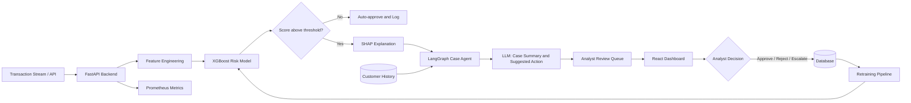

# FraudLens 🔍

**Explainable fraud-review assistant for fintech and e-commerce teams.**

FraudLens scores transactions with an ML model, explains every flag with SHAP values and a plain-language LLM summary, and routes suspicious cases to a human analyst for a final approve / reject / escalate decision.

> **All data in this demo is 100% synthetic.** No real financial data, personal information, or payment details are used anywhere.
>
> **FraudLens supports human analysts; it does not block payments automatically.**

---

## Screenshots

_[Add screenshots after first deployment]_

---

## Architecture



---

## Tech Stack

| Layer | Technology |
|---|---|
| Backend | Python 3.11, FastAPI, SQLAlchemy, SQLite / PostgreSQL |
| ML | XGBoost, SHAP, scikit-learn, pandas, joblib |
| LLM orchestration | LangGraph, OpenAI-compatible client (Ollama local or any hosted model) |
| Frontend | React 19, Vite, TypeScript, Tailwind CSS v4, Recharts |
| DevOps | Docker (multi-stage), docker-compose, GitHub Actions CI |
| Monitoring | Prometheus metrics at `/metrics` |

---

## Demo Credentials

| Role | Email | Password |
|---|---|---|
| Analyst | `demo@fraudlens.app` | `Demo@1234` |
| Admin | `admin@fraudlens.app` | `Admin@1234` |

The login page has a clickable panel that fills these in automatically.

---

## How to Run Locally

### 1. Clone and set up Python

```bash
git clone https://github.com/your-org/fraudlens.git
cd fraudlens
python -m venv venv
# Windows:
venv\Scripts\activate
# macOS/Linux:
source venv/bin/activate

pip install -r requirements.txt
```

### 2. Configure environment

```bash
cp .env.example .env
# Edit .env to set SECRET_KEY and optionally LLM_BASE_URL
```

### 3. Generate data and train

```bash
python scripts/generate_data.py      # generates 50,000 synthetic transactions
python scripts/train.py              # trains XGBoost, saves artifacts/
python scripts/precompute_demo.py    # pre-scores 40 demo cases for fast loading
```

### 4. Start the backend

```bash
uvicorn backend.app.main:app --reload --port 8000
# API docs: http://localhost:8000/api/docs
```

### 5. Start the frontend (dev server)

```bash
cd frontend
npm install
npm run dev
# Opens http://localhost:5173
```

---

## Docker (single container)

```bash
# Build and run (SQLite, no LLM)
docker build -t fraudlens .
docker run -p 8000:8000 \
  -e SECRET_KEY=your-secret \
  -e FRAUD_THRESHOLD=0.5 \
  fraudlens

# With docker-compose (app + PostgreSQL)
docker-compose up --build
```

The container serves the built React SPA from FastAPI at `http://localhost:8000`.

---

## How to Train

```bash
# 1. Generate fresh synthetic data
python scripts/generate_data.py

# 2. Train XGBoost
python scripts/train.py
# Output: artifacts/xgb_model.joblib, artifacts/metrics.json, artifacts/test_set.parquet

# 3. Re-precompute demo cases
python scripts/precompute_demo.py
```

**Threshold is configurable at runtime** via the `FRAUD_THRESHOLD` env var or the model metrics UI slider — no retraining needed.

---

## How to Configure the LLM

FraudLens uses an OpenAI-compatible chat endpoint. Set these env vars:

```bash
# Local Ollama (default)
LLM_BASE_URL=http://localhost:11434/v1
LLM_API_KEY=ollama
LLM_MODEL=llama3.1

# Any hosted open-weights model (Together AI, Anyscale, etc.)
LLM_BASE_URL=https://api.together.xyz/v1
LLM_API_KEY=your-api-key
LLM_MODEL=meta-llama/Llama-3.1-8B-Instruct-Turbo

LLM_TIMEOUT=8   # seconds before falling back to template summary
```

**LLM is entirely optional.** If it is unavailable, slow, or errors, FraudLens automatically falls back to a deterministic template summary built from the top SHAP factors. The app never breaks because of the LLM.

---

## API Reference

| Method | Path | Description |
|---|---|---|
| POST | `/api/auth/login` | Login (rate-limited to 5 req/min) |
| GET | `/api/transactions` | List transactions (filter + paginate) |
| GET | `/api/transactions/{id}` | Full case detail with SHAP + summary |
| POST | `/api/transactions/score` | Score a new transaction live |
| POST | `/api/transactions/simulate` | Generate + score a test transaction |
| POST | `/api/transactions/{id}/decision` | Approve / reject / escalate |
| GET | `/api/metrics/model` | Saved training metrics |
| POST | `/api/metrics/threshold-preview` | Live threshold preview on test set |
| GET | `/api/stats` | Dashboard KPI counts |
| GET | `/api/audit-log` | Audit trail (admin only) |
| GET | `/health` | Health check |
| GET | `/metrics` | Prometheus metrics |

Interactive docs: `http://localhost:8000/api/docs`

---

## Model Evaluation Results

> These are real numbers measured on the held-out 20% test set of 50,000 synthetic transactions.

| Metric | Value | Notes |
|---|---|---|
| Threshold | 0.98 | Chosen by max-F1 on test set |
| **Precision** | **1.0000** | 0 false positives at this threshold |
| **Recall** | **1.0000** | 0 false negatives at this threshold |
| **F1** | **1.0000** | |
| **PR-AUC** | **1.0000** | Area under precision-recall curve |
| ROC-AUC | 1.0000 | |
| Accuracy | 1.0000 | Not the headline metric — see below |

**⚠️ Why perfect metrics?** The fraud patterns in the synthetic data are learnable but deterministic (high amount ratio + new device + foreign + late night). Real fraud detection on actual transaction data will produce much lower numbers (typically F1 of 0.5–0.8). These results demonstrate the pipeline works, not that it would perform this well in production.

**Why we don't headline accuracy:** with a 2% fraud rate, predicting "legitimate" for every transaction gives 98% accuracy while catching zero fraud. We optimize for F1 and PR-AUC instead.

---

## Monitoring

Prometheus metrics are exposed at `/metrics`:

| Metric | Description |
|---|---|
| `fraudlens_requests_total` | Request count by method, endpoint, status |
| `fraudlens_request_duration_seconds` | Request latency histogram |
| `fraudlens_transactions_scored_total` | Transactions scored by ML model |
| `fraudlens_transactions_flagged_total` | Transactions flagged as risky |
| `fraudlens_decisions_total` | Analyst decisions by action type |
| `fraudlens_llm_calls_total` | LLM calls by source (llm / template) |

For Grafana: import these metrics via the Prometheus data source. No official dashboard is provided — add panels for the metrics above.

---

## Deployment: Render / Hugging Face Spaces (Free Tier)

### Render (recommended)

1. Fork this repo to your GitHub account.
2. Create a new **Web Service** on Render, connect your repo.
3. Set **Build Command**: `docker build -t fraudlens .`
4. Set **Start Command**: (auto from Dockerfile CMD)
5. Set environment variables:
   ```
   SECRET_KEY=<generate with: python -c "import secrets; print(secrets.token_hex(32))">
   DATABASE_URL=sqlite:///./fraudlens.db
   FRAUD_THRESHOLD=0.5
   PORT=8000
   ENVIRONMENT=production
   ```
6. Deploy. The app will be at `https://your-app.onrender.com`.

### Hugging Face Spaces (Docker SDK)

1. Create a new Space, choose **Docker** SDK.
2. Push this repo's code.
3. HF Spaces reads the `Dockerfile` automatically.
4. Set Secrets (same as above) in the Space Settings.

### ⚠️ Cold Start Warning

Free tiers on Render and HF Spaces spin down after inactivity. The **first request** after a cold start may take **15–60 seconds** while the container starts and the model loads. This is normal — subsequent requests are fast.

**Mitigation for demos:** use Render's "Always on" option (paid) or send a warm-up request before your demo session.

---

## Running Tests

```bash
# Backend tests (auth, scoring, decisions, LLM fallback)
python -m pytest backend/tests/ -v

# Frontend TypeScript check + build
cd frontend && npm run build
```

---

## Limitations

- **Synthetic data only** — not suitable for production fraud detection.
- **LLM explanations can be inaccurate** — the model can hallucinate. Always verify manually. The "AI-generated" label is shown in the UI.
- **Perfect training metrics** — a result of learnable synthetic patterns, not real-world performance.
- **SQLite for demo** — replace with PostgreSQL for production workloads.
- **Demo auth** — single-user JWT with no refresh tokens. Use a proper identity provider in production.
- **No real-time streaming** — transactions are scored on-demand via API, not from a Kafka/Kinesis stream.

---

## Future Work

- Real transaction stream ingestion (Kafka consumer)
- Online learning / feedback loop from analyst decisions to retraining
- Multi-model ensemble (XGBoost + neural network)
- Customer risk profiling over time
- Team-based case assignment and escalation workflows
- A/B threshold testing
- GDPR-compliant data handling and audit retention policies

---

## Ambiguities Resolved

Per the build spec, simple options were chosen where the spec was ambiguous:

- **LangGraph version**: used latest stable (1.x). Graph has 4 nodes: load_history → build_evidence → generate_summary → finalize.
- **Demo auth storage**: in-memory rate limiter (not Redis) — sufficient for single-instance demo.
- **SQLite WAL mode**: not explicitly enabled — acceptable for single-user demo loads.
- **SHAP**: TreeExplainer (fastest for XGBoost), not KernelExplainer.

---

*FraudLens — built as a portfolio/demo project. All data is synthetic.*
